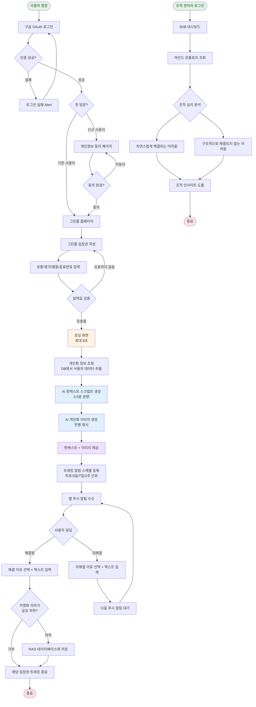
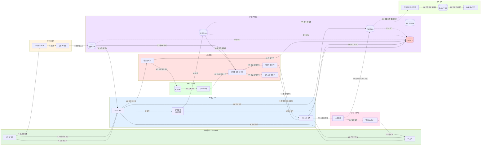
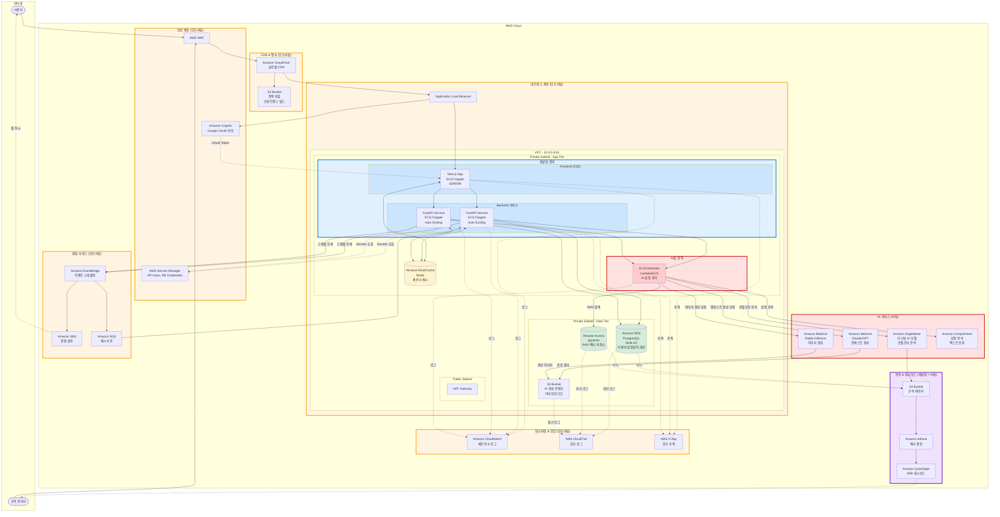

# MindQuery SystemArchitecture

- AWS 배포
- 개발팀(BE/FE), AI팀, 클라우드 인프라/보안팀 개발 아키텍처

## 유저 플로우

## 데이터 플로우

## 시스템 아키텍처

AWS## 시스템 아키텍처

### 팀별 책임 영역 (R&R)

#### 🏗️ **인프라팀 (Infrastructure Team)**

- **네트워크 & 보안**: VPC, Subnet, NAT Gateway, ALB, WAF, Cognito
- **CDN & 스토리지**: CloudFront, S3 (정적 파일)
- **모니터링**: CloudWatch, CloudTrail, X-Ray
- **알림 인프라**: EventBridge, SNS, SQS
- **비밀 관리**: Secrets Manager
- **배포 환경**: ECS 클러스터, Auto Scaling 설정

#### 💻 **개발팀 (Frontend/Backend Team)**

- **Frontend**: Next.js 애플리케이션 (SSR/ISR)
- **Backend**: FastAPI 서비스 (비즈니스 로직, API)
- **데이터베이스 스키마**: RDS PostgreSQL 스키마 설계
- **캐싱 로직**: ElastiCache Redis 활용
- **인증/인가**: Cognito 연동 및 세션 관리
- **비즈니스 로직**: 입장권, 트래킹, 사용자 관리

#### 🤖 **AI팀 (AI Team)**

- **AI 오케스트레이션**: AI 요청 관리 및 조율
- **팟캐스트 생성**: Bedrock Claude/GPT 활용
- **이미지 생성**: Bedrock Stable Diffusion 활용
- **RAG 시스템**: 벡터 DB 구축 및 유사성 검색
- **감정 분석**: Comprehend 활용
- **온톨로지 분석**: SageMaker 커스텀 모델
- **AI 모델 최적화**: 비용 및 품질 관리

#### 📊 **협업 영역 (개발팀 + AI팀)**

- **B2B 대시보드**: QuickSight 기반 조직 인사이트
- **데이터 분석**: Athena를 통한 쿼리 및 분석
